<h1 align="center">Hi 👋, I'm Darshan T P</h1>
<h3 align="center">AI Research Enthusiast | Deep Learning | Reinforcement Learning | Computer Vision</h3>

Building intelligent systems for smart infrastructure and real-world impact 🚀

 
   

<h1 align="left">Languages and Tools:</h1>

  

## 📊 GitHub Analytics

  
  

  

---

## 📈 Contribution Activity

---

## 📊 Advanced GitHub Metrics

  

---

## 🧠 Algorithmic Research & Problem Solving

Exploring computational efficiency, data structures, and algorithmic optimization through consistent problem solving.

  

---

## 📫 Connect With Me

- LinkedIn: (Add your link)
- Email: (Optional)
- Portfolio: (Add if available)

---

<i>"Engineering intelligence through data, models, and experimentation."</i>

